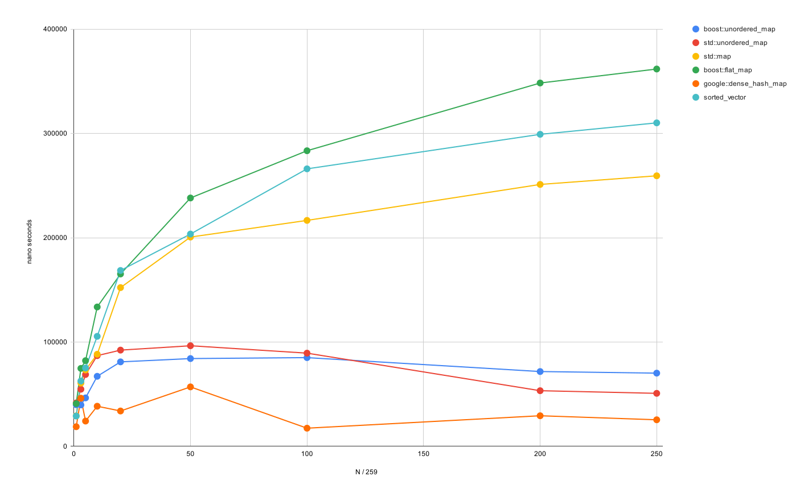

# benchmarks of querying {int, sizeof 40 bytes} data

## setup

```
Run on (8 X 1796.63 MHz CPU s)
CPU Caches:
  L1 Data 32 KiB (x8)
  L1 Instruction 32 KiB (x8)
  L2 Unified 512 KiB (x8)
  L3 Unified 4096 KiB (x8)
Load Average: 0.29, 0.09, 0.08
```

GCC12

## overall



## detailed numbers

- 🟩 1st fastest
- 🟦 2nd fastest
- 🟧 3rd fastest

| container                    |    |  perf       |
|------------------------------|----|-------------|
| boost::unordered\_map/1      |    |    39905 ns |
| std::unordered\_map/1        |    |    41652 ns |
| std::map/1                   | 🟧 |    29215 ns |
| boost::flat\_map/1           |    |    41008 ns |
| google::dense\_hash\_map/1   | 🟩 |    18846 ns |
| sorted\_vector/1             | 🟦 |    29076 ns |

| container                    |    |  perf       |
|------------------------------|----|-------------|
| boost::unordered\_map/3      | 🟩 |    39716 ns |
| std::unordered\_map/3        | 🟧 |    54766 ns |
| std::map/3                   |    |    60645 ns |
| boost::flat\_map/3           |    |    74739 ns |
| google::dense\_hash\_map/3   | 🟦 |    46183 ns |
| sorted\_vector/3             |    |    62617 ns |

| container                    |    |  perf       |
|------------------------------|----|-------------|
| boost::unordered\_map/5      | 🟦 |    46473 ns |
| std::unordered\_map/5        | 🟧 |    68894 ns |
| std::map/5                   |    |    73248 ns |
| boost::flat\_map/5           |    |    82159 ns |
| google::dense\_hash\_map/5   | 🟩 |    24262 ns |
| sorted\_vector/5             |    |    75142 ns |

| container                    |    |  perf       |
|------------------------------|----|-------------|
| boost::unordered\_map/10     | 🟦 |    67161 ns |
| std::unordered\_map/10       | 🟧 |    86973 ns |
| std::map/10                  |    |    88286 ns |
| boost::flat\_map/10          |    |   133612 ns |
| google::dense\_hash\_map/10  | 🟩 |    38475 ns |
| sorted\_vector/10            |    |   105467 ns |

| container                    |    |  perf       |
|------------------------------|----|-------------|
| boost::unordered\_map/20     | 🟦 |    80999 ns |
| std::unordered\_map/20       | 🟧 |    92263 ns |
| std::map/20                  |    |   152175 ns |
| boost::flat\_map/20          |    |   165236 ns |
| google::dense\_hash\_map/20  | 🟩 |    33921 ns |
| sorted\_vector/20            |    |   168582 ns |

| container                    |    |  perf       |
|------------------------------|----|-------------|
| boost::unordered\_map/50     | 🟦 |    84162 ns |
| std::unordered\_map/50       | 🟧 |    96443 ns |
| std::map/50                  |    |   200624 ns |
| boost::flat\_map/50          |    |   238073 ns |
| google::dense\_hash\_map/50  | 🟩 |    57016 ns |
| sorted\_vector/50            |    |   203508 ns |

| container                    |    |  perf       |
|------------------------------|----|-------------|
| boost::unordered\_map/100    | 🟦 |    85067 ns |
| std::unordered\_map/100      | 🟧 |    89352 ns |
| std::map/100                 |    |   216582 ns |
| boost::flat\_map/100         |    |   283349 ns |
| google::dense\_hash\_map/100 | 🟩 |    17434 ns |
| sorted\_vector/100           |    |   266001 ns |

| container                    |    |  perf       |
|------------------------------|----|-------------|
| boost::unordered\_map/200    | 🟧 |    71725 ns |
| std::unordered\_map/200      | 🟦 |    53363 ns |
| std::map/200                 |    |   251054 ns |
| boost::flat\_map/200         |    |   348272 ns |
| google::dense\_hash\_map/200 | 🟩 |    29355 ns |
| sorted\_vector/200           |    |   299090 ns |

| container                    |    |  perf       |
|------------------------------|----|-------------|
| boost::unordered\_map/250    | 🟧 |    70197 ns |
| std::unordered\_map/250      | 🟦 |    50833 ns |
| std::map/250                 |    |   259334 ns |
| boost::flat\_map/250         |    |   361678 ns |
| google::dense\_hash\_map/250 | 🟩 |    25486 ns |
| sorted\_vector/250           |    |   310065 ns |

